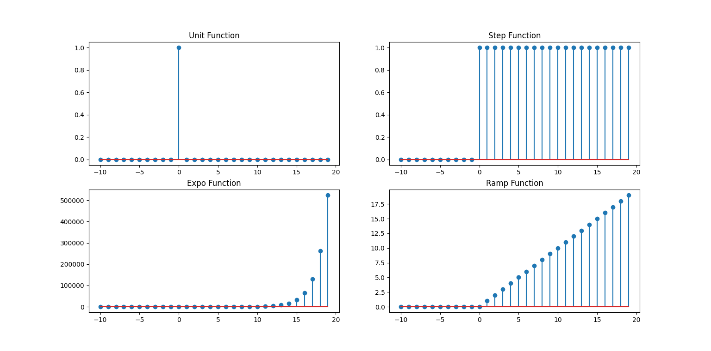
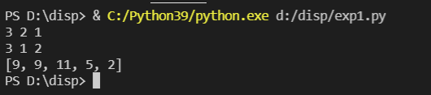
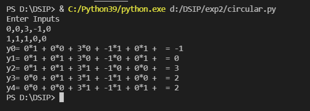
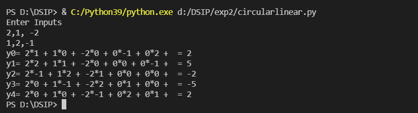

# DSIP LAB

## Table of contents

- [Overview](#overview)
- [Screenshots](#screenshots)
- [Built with](#built-with)
- [Author](#author)

## Overview

### DSIP LAB
Dsip Lab Experiment Programs

### Screenshots

- Experiment 1 A

- Experiment 2 

### Built with

## Author
 - Hayden Cordeiro   
 
   

